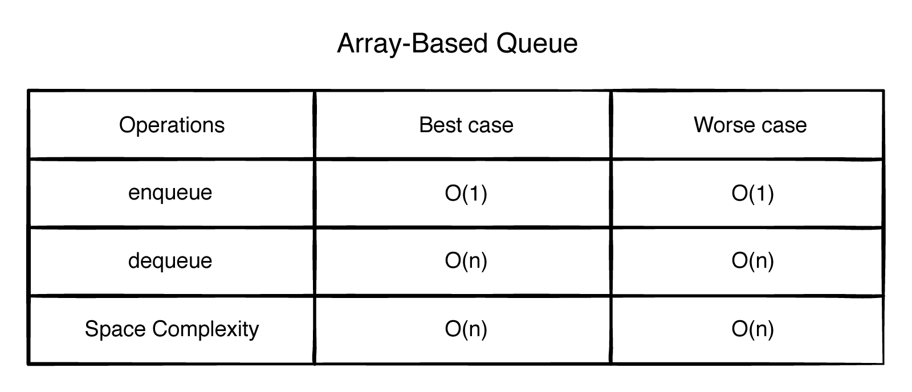

# Queues

We’re all familiar with waiting in line. Whether you’re in line to buy tickets to your
favorite movie or waiting for a printer to print a file, these real-life scenarios mimic
the queue data structure.
Queues use FIFO or first in, first out ordering, meaning the first element that was
added will always be the first one removed. Queues are handy when you need to
maintain the order of your elements to process later.

The core operations for a queue are:
- **enqueue**: Inserts an element at the back of the queue and returns true if the
operation is successful.
- **dequeue**: Removes the element at the front of the queue and returns it.
- **isEmpty**: Checks if the queue is empty using the count property
- **peek**: Returns the element at the front of the queue without removing it.

### ArrayList implementation

You’ve seen how easy it is to implement a list-based queue by leveraging a Kotlin
ArrayList. Enqueue is very fast, thanks to an O(1) append operation.
There are some shortcomings to the implementation. Removing an item from the
front of the queue can be inefficient, as removal causes all elements to shift up by
one. This makes a difference for very large queues. Once the list gets full, it has to
resize and may have unused space. This could increase your memory footprint over
time. Is it possible to address these shortcomings? Let’s look at a linked list-based
implementation and compare it to an ArrayListQueue.

### LinkedList implementation

One of the main problems with ArrayListQueue is that dequeuing an item takes
linear time. With the linked list implementation, you reduced it to a constant
operation, O(1). All you needed to do was update the node’s previous and next
pointers.
The main weakness with LinkedListQueue is not apparent from the table. Despite
O(1) performance, it suffers from high overhead. Each element has to have extra
storage for the forward and back reference. Moreover, every time you create a new
element, it requires a relatively expensive dynamic allocation. By contrast,
ArrayListQueue does bulk allocation, which is faster.

### Double Stack implementation
The idea behind using two stacks is simple. Whenever you enqueue an element, it
goes in the right stack. When you need to dequeue an element, you reverse the right stack and place it in the
left stack so that you can retrieve the elements using FIFO order.

Compared to the list-based implementation, by leveraging two stacks, you were able
to transform dequeue() into an amortized O(1) operation.
Finally, it beats the linked list in terms of spatial locality. This is because list
elements are next to each other in memory blocks. So a large number of elements
will be loaded in a cache on first access.

