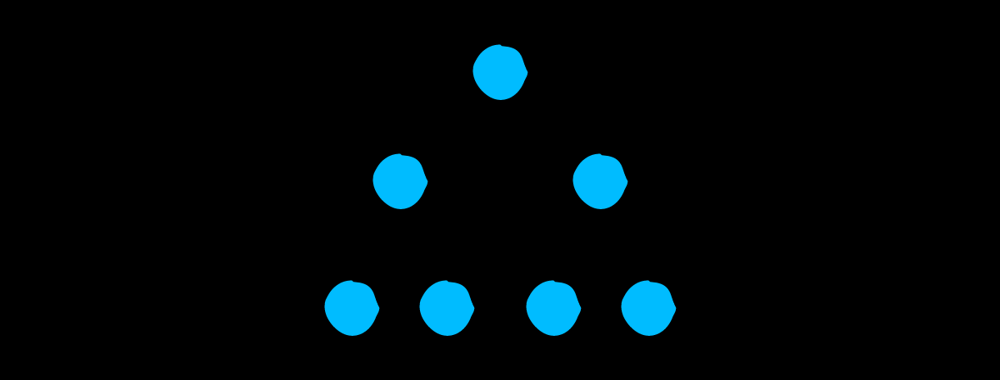
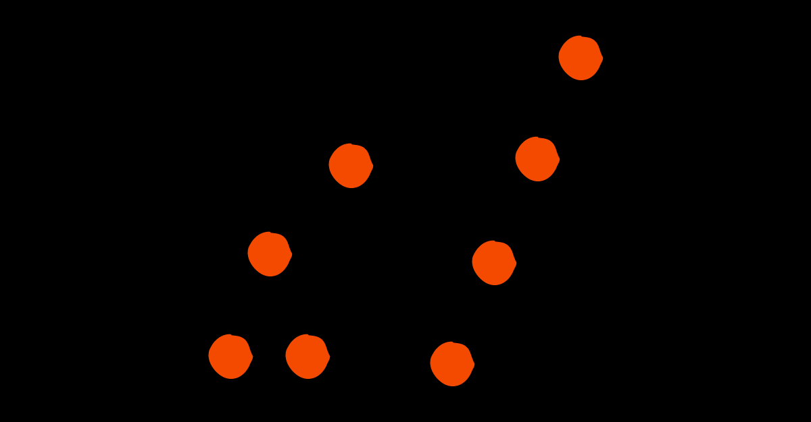
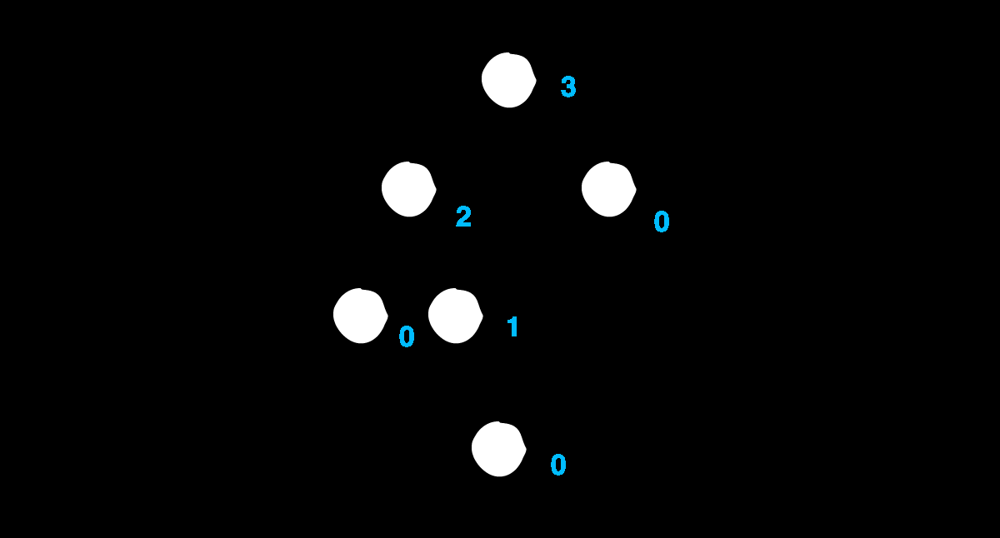
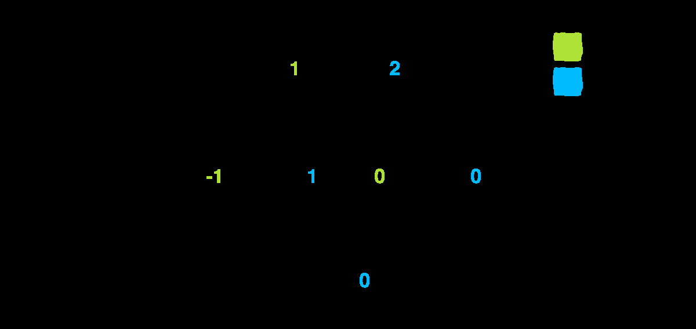

# AVL Tree

In 1962, Georgy Adelson-Velsky and Evgenii Landis came up with the first self-
balancing binary search tree:

A balanced tree is the key to optimizing the performance of the binary search tree.
There are three main states of balance. You’ll look at each one.
## Perfect balance

Every level of the tree is filled with nodes from top to bottom.

Not only is the tree perfectly symmetrical, but the nodes at the bottom level are also
completely filled. Note that perfect balanced trees can just have a specific number of
nodes. For instance 1, 3 or 7 are possible number of nodes because they can fill 1, 2
or 3 levels respectively. This is the requirement for being perfectly balanced.

## Good-enough balance

A balanced tree must have all its levels
filled, except for the bottom one. In most cases of binary trees, this is the best you
can do.

## Unbalanced

Finally, there’s the unbalanced state. Binary search trees in this state suffer from
various levels of performance loss depending on the degree of imbalance.

### Measuring balance
To keep a binary tree balanced, you need a way to measure the balance of the tree.
The AVL tree achieves this with a height property in each node. In tree-speak, the
height of a node is the longest distance from the current node to a leaf node:

The height of the left and right children of each node must differ at most by 1. This is
known as the balance factor.
The balanceFactor computes the height difference of the left and right child. If a
particular child is null, its height is considered to be -1.
A balanceFactor of 2 or -2 is an indication of an
unbalanced tree.

## Rotations
The procedures used to balance a binary search tree are known as rotations. There
are four rotations in total, one for each way that a tree can become unbalanced.
These are known as left rotation, left-right rotation, right rotation and right-left
rotation.

There are three cases to consider.
1. A balanceFactor of 2 suggests that the left child is heavier (that is, contains
   more nodes) than the right child. This means that you want to use either right or
   left-right rotations.

2. A balanceFactor of -2 suggests that the right child is heavier than the left child.
   This means that you want to use either left or right-left rotations.

3. The default case suggests that the particular node is balanced. There’s nothing to
   do here except to return the node.
