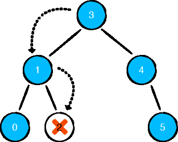
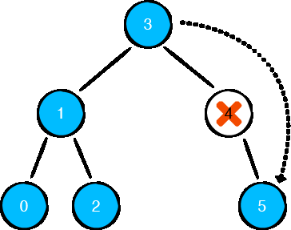
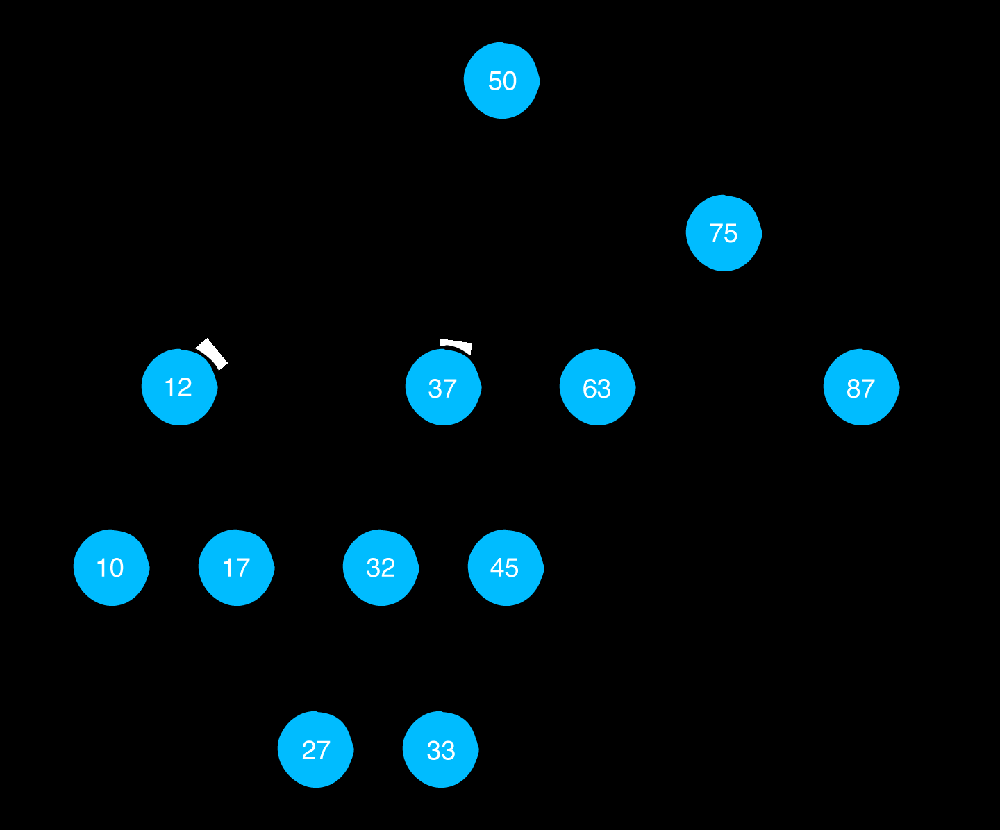
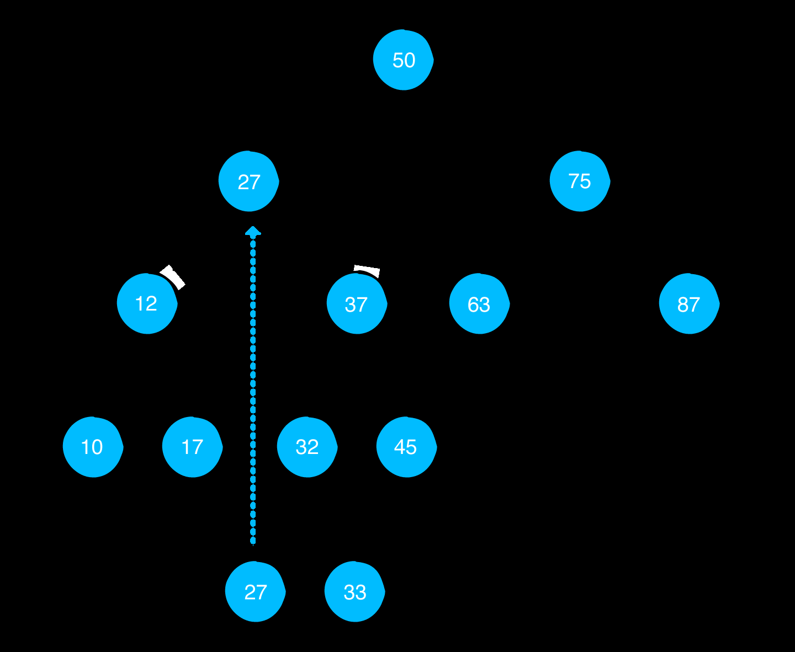
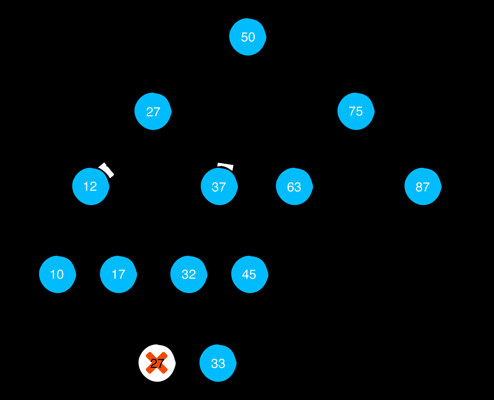

# Binary Search Trees
A binary search tree, or BST, is a data structure that facilitates fast lookup, insert
and removal operations. Consider the following decision tree where picking a side
forfeits all of the possibilities of the other side, cutting the problem in half.

Once you make a decision and choose a branch, there’s no looking back. You keep
going until you make a final decision at a leaf node. Binary trees let you do the same
thing. Specifically, a binary search tree imposes two rules on the binary tree 

- The value of a left child must be less than the value of its parent.

- Consequently, the value of a right child must be greater than or equal to the value
of its parent.

Binary search trees use this property to save you from performing unnecessary
checking. As a result, lookup, insert and removal have an average time complexity of
**O(log n)**, which is considerably faster than linear data structures such as arrays and
linked lists.

## Especial attention to Removing elements
Removing elements is a little more tricky, as there are a few different scenarios you
need to handle.

### Case 1: leaf node
Removing a leaf node is straightforward; simply detach the leaf node.

#### **_For non-leaf nodes, however, there are extra steps you must take._**

### Case 2: Nodes with one child
When removing nodes with one child, you need to reconnect that one child with the
rest of the tree.

### Case 3: Nodes with two children
Nodes with two children are a bit more complicated, so a more complex example tree
will serve better to illustrate how to handle this situation. Assume that you have the
following tree and that you want to remove the value 25:

Simply deleting the node presents a dilemma.

You have two child nodes (12 and 37) to reconnect, but the parent node only has
space for one child. To solve this problem, you’ll implement a clever workaround by
performing a swap.
When removing a node with two children, replace the node you removed with the
smallest node in its right subtree. Based on the rules of the BST, this is the leftmost
node of the right subtree:

It’s important to note that this produces a valid binary search tree. Because the new
node was the smallest node in the right subtree, all of the nodes in the right subtree
will still be greater than or equal to the new node. And because the new node came
from the right subtree, all of the nodes in the left subtree will be less than the new
node.
After performing the swap, you can simply remove the value you copied, which is
just a leaf node.

