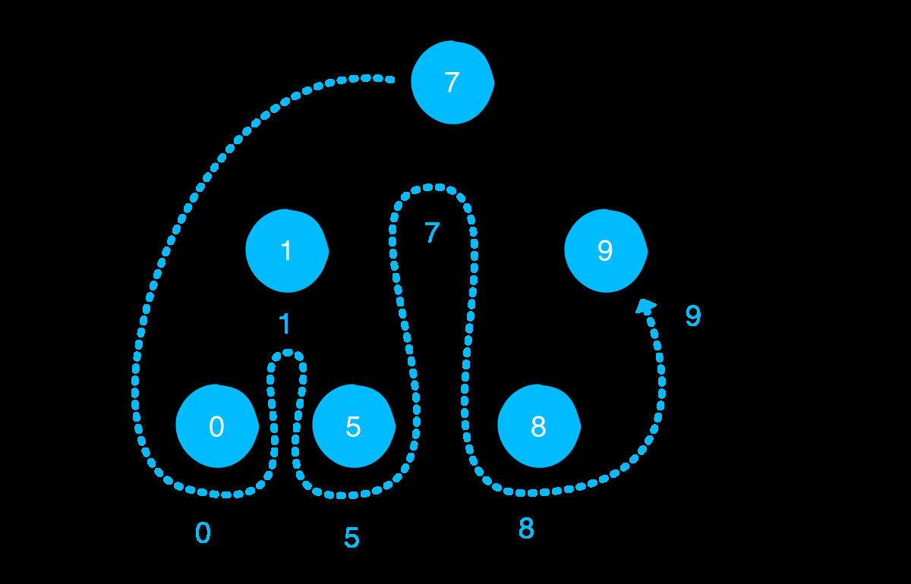
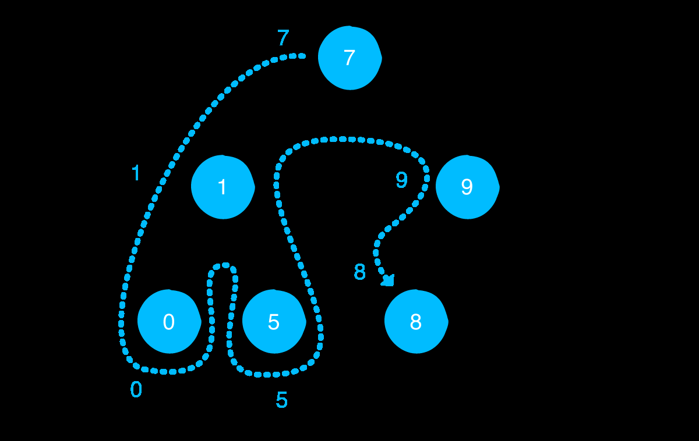
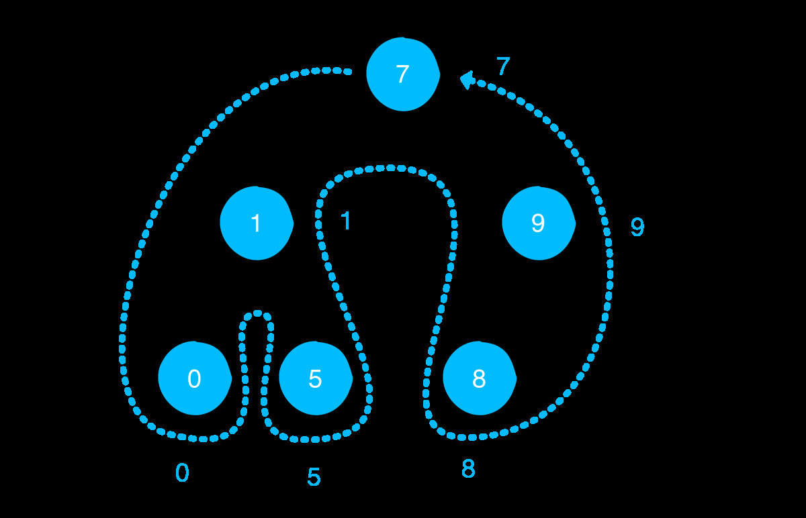

# Binary tree
.jpg)

A binary tree is a tree in which each node has at most two children, often
referred to as the left and right children:

### In Order traversal 

In-order traversal visits the nodes of a binary tree in the following order, starting
from the root node:
- If the current node has a left child, recursively visit this child first.
-  Then visit the node itself.
-  If the current node has a right child, recursively visit this child.

You may have noticed that this prints the example tree in ascending order. If the tree
nodes are structured in a certain way, in-order traversal visits them in ascending
order. 

### Pre-order traversal
Pre-order traversal visits the nodes of a binary tree in the following order:
- Visits the current node first.
- Recursively visits the left and right child.

### Post-order traversal
Post-order traversal always visits the nodes of a binary tree in the following order:
- Recursively visits the left and right child.
- Only visits the current node after the left and right child have been visited
recursively.

**Each one of these traversal algorithms has both a time and space complexity of O(n).**